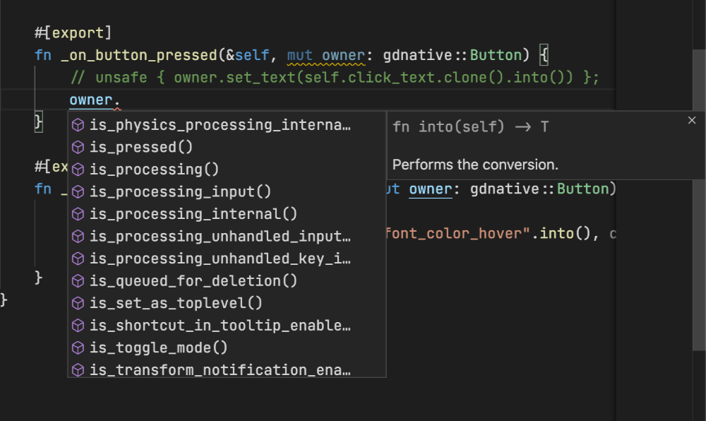

# FAQ

## Avoiding a `BorrowFailed` error on method call

**Question**

What is the `BorrowFailed` error and why I keep getting it? I'm only trying to call another method that takes `&mut self` while holding one!

**Answer**

In Rust, [there can only be *one* `&mut` reference to the same memory location at the same time](https://docs.rs/dtolnay/0.0.9/dtolnay/macro._02__reference_types.html). To enforce this while making simple use cases easier, the bindings make use of [interior mutability](https://doc.rust-lang.org/book/ch15-05-interior-mutability.html). This works like a lock: whenever a method with `&mut self` is called, it will try to obtain a lock on the `self` value, and hold it *until it returns*. As a result, if another method that takes `&mut self` in called in the meantime for whatever reason (e.g. signals), the lock will fail and a error (`BorrowFailed`) will be produced.

It's relatively easy to work around this problem, though: Because of how the user-data container works, it can only see the outermost layer of your script type - the entire structure. This is why it's stricter than what is actually required. If you run into this problem, you can [introduce finer-grained interior mutability](https://doc.rust-lang.org/book/ch15-05-interior-mutability.html) in your own type, and modify the problematic exported methods to take `&self` instead of `&mut self`.

## Passing additional arguments to a class constructor

**Question**

A native script type needs to implement `fn new(owner: &Node) -> Self`.
Is it possible to pass additional arguments to `new`?

**Answer**

Unfortunately this is currently a general limitation of GDNative (see [related issue](https://github.com/godotengine/godot/issues/23260)).

As a result, a common pattern to work-around the limitation is to use explicit initialization methods. For instance:

```rust
#[derive(NativeClass)]
#[inherit(Object)]
struct DataWrapper {
    data: Option<Data>,
}

#[godot::methods]
impl DataWrapper {
    fn new(_owner: &Object) -> Self {
        DataWrapper {
            data: None,
        }
    }

    #[export]
    fn set_data(&mut self, _owner: &Object, additional_arg1: i32, additional_arg2: i32) {
        self.data = Some(Data::new(additional_arg1, additional_arg2));
    }
}
```


## Static methods

**Question**

In GDScript, classes can have static methods.
However, when I try to omit `self` in the exported method signature, I'm getting a compile error.
How can I implement a static method?

**Answer**

This is another limitation of GDNative -- static methods are not supported in general.

As a work-around, it is possible to use a ZST (zero-sized type):

```rust
#[derive(NativeClass, Copy, Clone, Default)]
#[user_data(Aether<StaticUtil>)]
#[inherit(Object)]
pub struct StaticUtil;

#[godot::methods]
impl StaticUtil {
    #[export]
    fn compute_something(&self, _owner: &Object, input: i32) -> i32 {
        godot_print!("pseudo-static computation");
        2 * input
    }
}
```

[`Aether`](https://docs.rs/gdnative/0.9/gdnative/prelude/struct.Aether.html) is a special user-data wrapper intended for zero-sized types, that does not perform any allocation or synchronization at runtime.

The type needs to be instantiated somewhere on GDScript level.
Good places for instantiation are for instance:

- as a member of a long-living util object,
- as a [singleton auto-load object](https://docs.godotengine.org/en/stable/getting_started/step_by_step/singletons_autoload.html).


## Converting a Godot type to the underlying Rust type

**Question**

I have a method that takes an argument `my_object` as a `Variant`.
I know that this object has a Rust native script attached to it, called say `MyObject`.
How can I access the Rust type given the Variant?

**Answer**

This conversion can be accomplished by casting the `Variant` to a `Ref`, and then to an `Instance` or `RefInstance`, and mapping over it to access the Rust data type:

```rust
#[godot::methods]
impl AnotherNativeScript {

    #[export]
    pub fn method_accepting_my_object(&self, _owner: &Object, my_object: Variant) {
        // 1. Cast Variant to Ref of associated Godot type, and convert to TRef.
        let my_object = unsafe {
            my_object
                .try_to_object::<Object>()
                .expect("Failed to convert my_object variant to object")
                .assume_safe()
        };
        // 2. Obtain a RefInstance.
        let my_object = my_object
            .cast_instance::<MyObject>()
            .expect("Failed to cast my_object object to instance");
        // 3. Map over the RefInstance to extract the underlying user data.
        my_object
            .map(|my_object, _owner| {
                // now my_object is of type MyObject
            })
            .expect("Failed to map over my_object instance");
    }

}

```

## Auto-completion with rust-analyzer

**Question**

`godot-rust` generates most of the gdnative type's code at compile-time. Editors using [rust-analyzer](https://github.com/rust-analyzer/rust-analyzer) struggle to autocomplete those types:


**Answer**

People [reported](https://github.com/rust-analyzer/rust-analyzer/issues/5040) similar issues and found that switching on the `"rust-analyzer.cargo.loadOutDirsFromCheck": true` setting fixed it:

