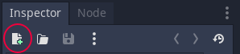
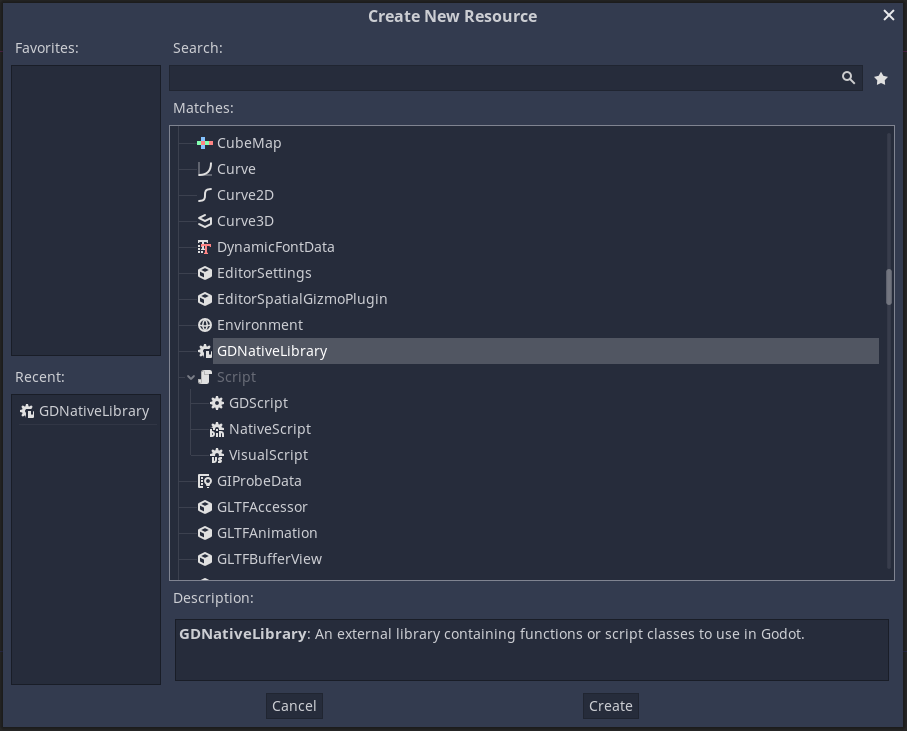
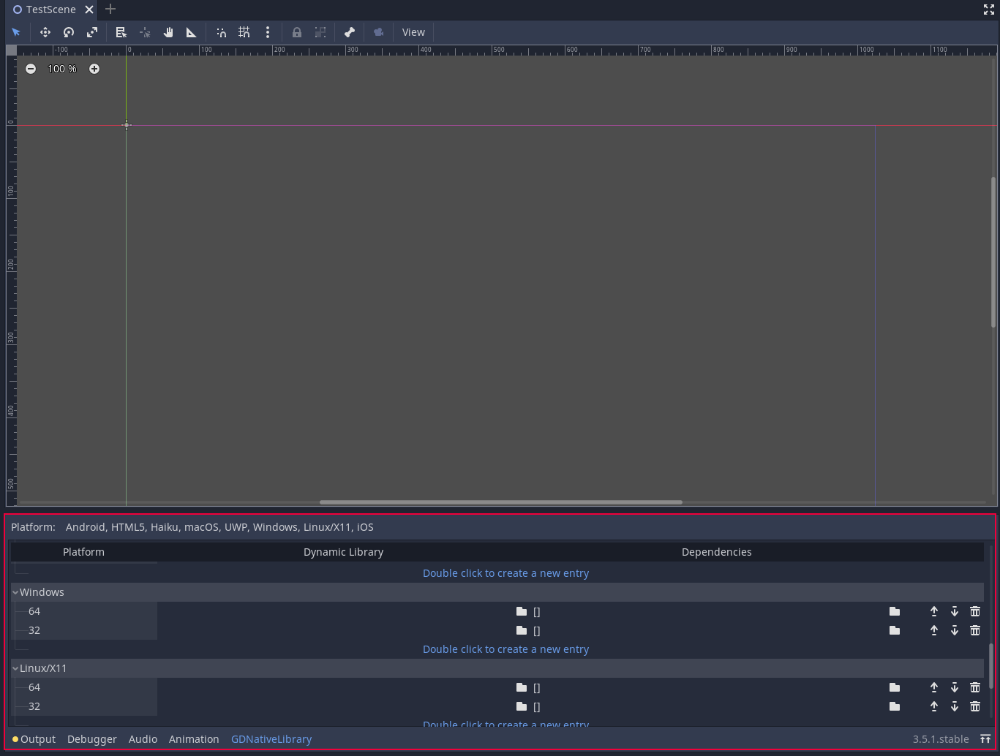
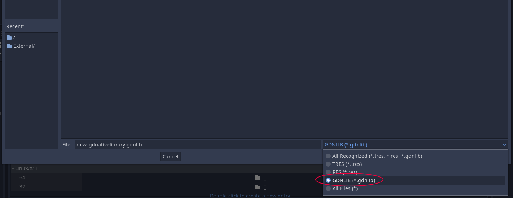
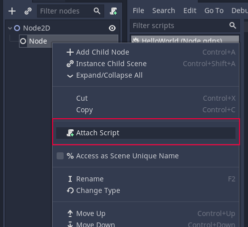
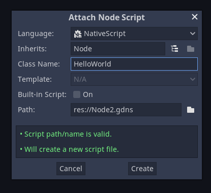
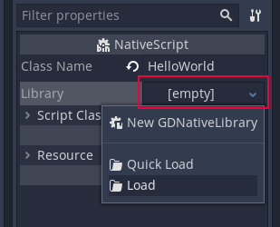

# Hello, world!

Follow this tutorial to learn how to create an empty project that simply prints "Hello, world!" to the Godot console on ready. The code might not compile or work as intended while it's in-progress, but at the end of this section, the code will be compiling and working fine.

The full, finished code is available in the main repo: [https://github.com/godot-rust/godot-rust/tree/master/examples/hello-world](https://github.com/godot-rust/godot-rust/tree/master/examples/hello-world).


## Creating the project

First, create an empty project using the Godot GUI. Then, create an empty crate *beside* the project folder using `cargo`:

```sh
cargo init --lib my-gdnative-lib
```

Your file structure should look like this:

```
.
├─── my-gdnative-lib
│   ├─── src
│   │   ├   lib.rs
│   ├   Cargo.toml
├─── my-godot-project
│   ├─── .import
│   ├   icon.png
│   ├   icon.png.import
│   └   project.godot
```

Once the project is created, open `Cargo.toml`, change the crate type to `cdylib`, and add `gdnative` as a dependency:


```toml
[lib]
crate-type = ["cdylib"]

[dependencies]
gdnative = "0.10"
```

> ### Organization of Rust code
>
> While it's also possible to place the Rust crate within the Godot project, doing so might lead to problems with Godot's resource importer. It's best to place the Rust crate somewhere outside the Godot project directory.
>
> Previously, some third-party resources have recommended separating Rust code into multiple crates. While this is fine to do, godot-rust works best when there is a single `cdylib` crate acting as the entry point for all crates in the workspace. Script downcasting, for example, only works for types registered in the same GDNative library. Code from `std` and other dependencies can also lead to code bloat when duplicated in multiple binaries.
> 
> We suggest that users start projects as a single crate, and only split code into workspaces when necessary.


## Boilerplate

You should now be able to compile your crate into a dynamic library, but a little bit of boilerplate is required before Godot can actually be able to load it as a GDNative library. Replace the contents of `lib.rs` with the following code:

```rust
use gdnative::prelude::*;

// Function that registers all exposed classes to Godot
fn init(handle: InitHandle) {
}

// Macro that creates the entry-points of the dynamic library.
godot_init!(init);
```

The code does several things:

```rust
use gdnative::prelude::*;
```

This imports a number of commonly used types and traits into the scope. Generally, you'll want this at the top of every file where you need to interact with GDNative.

```rust
// Function that registers all exposed classes to Godot
fn init(handle: InitHandle) {
}
```

This declares an empty callback function, which is called when the library is loaded by Godot. All script classes in the library should be "registered" here using `handle.add_class::<MyNativeClass>()`. You only need *one* of this in the entire library.

```rust
// Macro that creates the entry-points of the dynamic library.
godot_init!(init);
```

This macro defines the necessary C callbacks used by Godot. You only need *one* invocation of this macro in the entire library. Note how the `init` function defined earlier is given to the `godot_init!` macro as a callback.

> ### GDNative internals
>
> The purposes of this macro will be discussed in detail in [_An Overview of GDNative_](../gdnative-overview.md). For now, treat it as a magic incantation.


## Your first script

With the boilerplate put into place, you can now create your first Rust script! We will go step by step and discover what's needed to create script "classes". Intermediate code versions might not compile, but at the end of this section it should be working!

A script is simply a Rust type that implements (derives) the `NativeClass` trait:

```rust
/// The HelloWorld "class"
#[derive(NativeClass)]
#[inherit(Node)]
pub struct HelloWorld;

// Function that registers all exposed classes to Godot
fn init(handle: InitHandle) {
    // Register the new `HelloWorld` type we just declared.
    handle.add_class::<HelloWorld>();
}
```

Similar to the GDScript `extends` directive, the `inherit` attribute tells godot-rust the most general base class your script can be attached to. Here, `Node` is the parent class of all nodes in the scene tree, so it would be possible to attach `HelloWorld` to any node or scene in Godot.

Unfortunately, this won't compile just yet: Rust will complain about the lack of a `new` method and a `NativeClassMethods` trait. This is because all scripts must also have a zero-argument constructor and a set of exported methods. To fix this, simply add two `impl` blocks:

```rust
// You may add any number of ordinary `impl` blocks as you want. However, ...
impl HelloWorld {
    /// The "constructor" of the class.
    fn new(_base: &Node) -> Self {
        HelloWorld
    }
}

// Only __one__ `impl` block can have the `#[methods]` attribute, which
// will generate code to automatically bind any exported methods to Godot.
#[methods]
impl HelloWorld {
}
```

The `HelloWorld` type is like any regular Rust type, and can have any number of ordinary `impl` blocks. However, it must have **one and only one** `impl` block with the `#[methods]` attribute, which tells godot-rust to generate code that automatically binds any exported methods to Godot.


## Creating the NativeScript resource

You should now be able to build the dynamic library with a `HelloWorld` script class in it. However, we also need to tell Godot about it. To do this, build the library with `cargo build`.

After building the library with `cargo build`, the resulting library should be in the `target/debug/` folder. Copy it (or create a symbolic link to it) somewhere inside the Godot project directory.

To tell Godot about the `HelloWorld` class, a `GDNativeLibrary` resource has to be created. This can be done in the "Inspector" panel in the Godot editor by clicking the "new resource" button in the top left.




With the `GDNativeLibrary` resource created, the path to the generated binary can be set in the editor.



After specifying the path, save the `GDNativeLibrary` resource. Be sure to change the file type to `GDNLIB`.



Now, the `HelloWorld` class can be added to any node by clicking the "attach script" button.



In the popup, select "NativeScript" as the language, and set the class name to `HelloWorld`.



Then, select the `NativeScript` resource in the Inspector, click the `library` field and point to the `GDNativeLibrary` resource that you created earlier.




## Overriding a Godot method

You can now run your project from the editor! If all goes correctly, it should launch but do nothing. That's because we haven't added any actual behaviors yet! To make our script actually do something, we can override the [`_ready`](https://docs.godotengine.org/en/stable/classes/class_node.html#class-node-method-ready) method in the `impl` block with the `#[methods]` attribute:

```rust
// Only __one__ `impl` block can have the `#[methods]` attribute, which
// will generate code to automatically bind any exported methods to Godot.
#[methods]
impl HelloWorld {

    // To make a method known to Godot, use the #[method] attribute.
    // In Godot, script "classes" do not actually inherit the parent class.
    // Instead, they are "attached" to the parent object, called the "base".
    //
    // If access to the base instance is desired, the 2nd parameter can be
    // annotated with #[base]. It must have type `&T` or `TRef<T>`, where `T`
    // is the base type specified in #[inherit]. If you don't need this parameter,
    // feel free to omit it entirely.
    #[method]
    fn _ready(&self, #[base] base: &Node) {
        // The `godot_print!` macro works like `println!` but prints to the Godot-editor
        // output tab as well.
        godot_print!("Hello world from node {}!", base.to_string());
    }
}
```

Here, the `#[method]` attribute is used to tell godot-rust to expose your methods to Godot. In this case, we are overriding [`_ready`](https://docs.godotengine.org/en/stable/classes/class_node.html#class-node-method-ready) and printing a line of text.

Now, re-compile the crate using `cargo build` and copy the resulting binary to the Godot project. Launch the project from the editor, and you should see `Hello, world!` in the Godot console!


## Wrapping it up

Congratulations! You have just created your first Rust GDNative library. You have learned how to expose scripts and methods to Godot using the bindings, and how to use them in Godot. A lot of the details are still unexplained, but you're off to a good start!

You can find the full code for this example in the main repo: [https://github.com/godot-rust/godot-rust/tree/master/examples/hello-world](https://github.com/godot-rust/godot-rust/tree/master/examples/hello-world).


## Work-in-progress

**The Getting Started tutorial is a work-in-progress, and unfortunately it ends here for now!** To learn more about the API, you'll have to dive into the [documentation on docs.rs](https://docs.rs/gdnative/latest), and the [other examples in the main repo]( https://github.com/godot-rust/godot-rust/tree/master/examples/). If you have any questions using the bindings, ask away in the `#gdnative_dev` channel on the [Godot Engine community Discord server](https://godotengine.org/community)!
