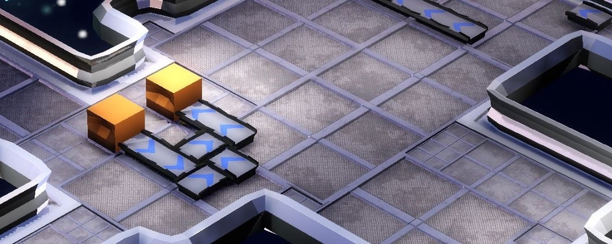
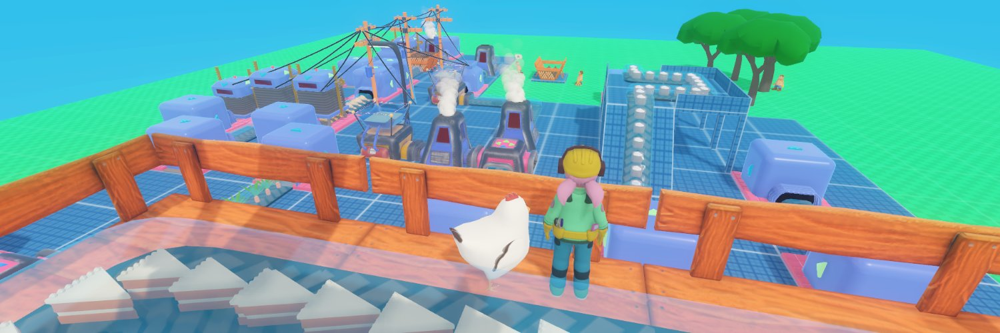
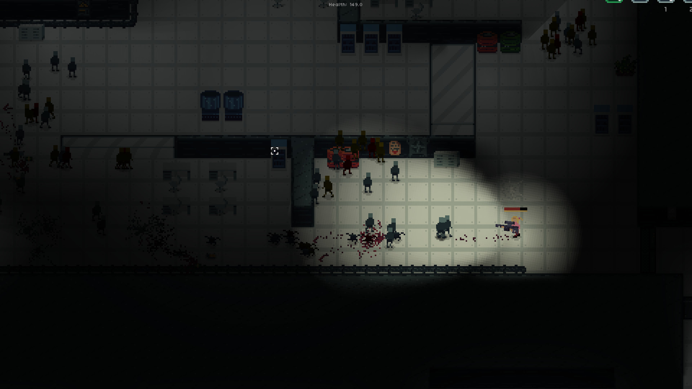
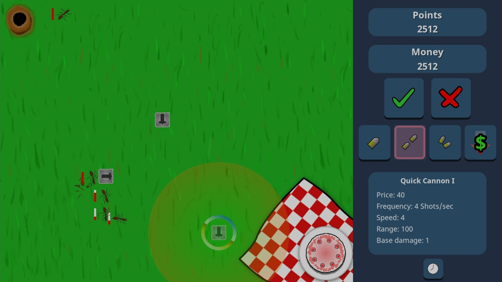

# Projects: Games

Below you see a non-exhaustive list of games that have been developed with godot-rust.

The page focuses on entries which are either in a playable state, or at least have some basic mechanics and graphics to show. For example, such an entry could be an indie game developed over many months, or also a polished game jam submission. The condition is that a notable part of the game is written in godot-rust, however it doesn't need to be the majority. For example, [one of the common architectures](../overview/architecture.md) entails using Rust for selective modules.

### Table of contents
<!-- toc -->

## The Recall Singularity

_by **Jump to Warp** (Tom Leys)_  
🕊️ _[@RecallSingular1](https://twitter.com/RecallSingular1)_

The Recall Singularity is a factory game, set within a player-controlled fleet of space-ships.  
Players blast asteroids, collect rocks, grind them up and turn them into ship parts. 

## The Process

_by **setzer22**_  
🕊️ _[@PlayTheProcess](https://twitter.com/PlayTheProcess)_

The Process is an upcoming game about factory building, process management, and carrot production, built with godot-rust!

The game offers a similar experience to other titles in the factory building genre (Factorio, Satisfactory), but is more tailored towards a chill, lighthearted atmosphere.

## BITGUN

_by **LogLogGames**_  
🕹️ _[**Steam**](https://store.steampowered.com/app/1673940/BITGUN)_ | 🕊️ _[@LogLogGames](https://twitter.com/LogLogGames)_ | 🌐 _[Website](https://loglog.games)_

BITGUN is an action roguelike zombie shooter with lots of blood and guns.

## BENDYWORM

_by **Bauxitedev**_  
🕹️ _[**itch.io**](https://bauxite.itch.io/bendyworm)_ | 🕊️ _[@bauxitedev](https://twitter.com/bauxitedev)_ | 📜 _[GitHub](https://github.com/Bauxitedev/bendyworm) (game is open-source)_

BENDYWORM is a platformer with a twist: the entire world bends and twists around you as you progress through the level. Why? Because you're inside of a gigantic worm, and worms are bendy. Navigate the worm's slippery innards, collect the Mega Cannon, and destroy its brain to escape!

## Cake Thieves

_by **GeTech**_  
🕹️ _[**Google Play**](https://play.google.com/store/apps/details?id=com.GeTech.CakeThieves)_ | 🕊️ _[@GeTech8](https://twitter.com/GeTech8)_

Thieves have found your picnic and want to eat your delicious cake! Protect it by placing cannons on the field to defeat the ants. Improve your cannons to increase their power! How well will you do in this challenge?
